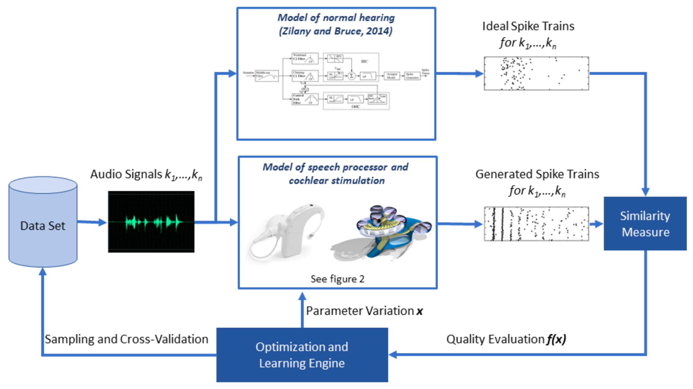

**Partners:** <a href="https://www.universiteitleiden.nl/en/medicine-lumc" target="_blank">Leiden University Medical Centre</a>   

According to the World Health Organisation (WHO), more than 5% of the world's population suffers from hearing loss. Electric inner ear prostheses (cochlear implants, CIs) are now the standard treatment for the deaf and severely hard of hearing. With these, they can regain much of their communicative abilities and stay more socially active. CIs also enable the development of spoken language in deaf children, thus offering them better opportunities for education, employment, and social integration. A significant limitation of CIs is their very limited capacity to convey detailed temporal information of sound to the auditory nerve. TEMPORAL combines computer modelling, modern artificial intelligence (AI) techniques, and patient-oriented research to develop a new speech encoding strategy that better encodes temporal information on the auditory nerve. This will lead to improved perception of music, tonal languages such as Chinese, better speech understanding in (fluctuating) background noise, and improved directional hearing, both with two CIs and with a CI and a hearing aid on the other ear (bimodal hearing).  

More specifically, within TEMPORAL, work will be carried out to:
  
* expand the Leiden computer model of the electrically implanted inner ear with a simulated speech processor, implement a comparable computer model of natural hearing, and add hearing with two ears (with two CIs or bimodally);
* adjust the adjustable parameters of the CIs to better approximate the nerve impulses, utilising the latest machine learning techniques, ensuring that the results are valid not only in the test situation but also beyond;
* run psychophysical tests and clinical trials with CI users and normal-hearing subjects to validate the outcomes of the other two tasks.  

This project is carried out together the ENT-department of Leiden University Medical Centre (Prof. Dr Ir J.H.M. Frijns, Dr Ir J.J.Briaire).
Out of 3 PhD students working on this project, one student is employed at LIACS and two PhDs students – at LUMC.
